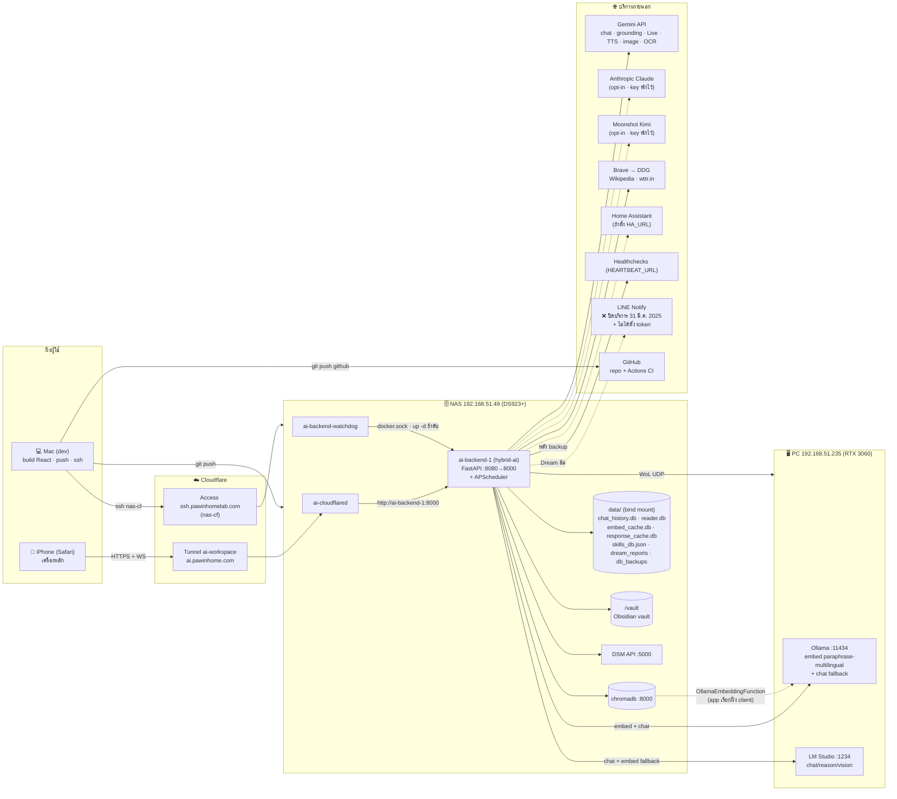

# ผังโครงสร้างทั้งระบบ — Khim AI (Hybrid AI Workspace)

สร้าง 2026-10-07 (ร่าง · อ่านโค้ดอย่างเดียว ไม่ได้ probe prod) · **ผังนี้ตอบ "อะไรต่อกับอะไร + ถ้าตัวไหนล่มอะไรพัง"**
รายละเอียดเชิงลึกไม่ก๊อปซ้ำ — ชี้ไปที่:
[`ui-map.md`](ui-map.md) (ส่วนบนจอ → React/overlay) · [`reference/architecture.md`](reference/architecture.md) (request flow · memory · Dream) ·
[`reference/infra-nas.md`](reference/infra-nas.md) (deploy/inode/SSH) · [`reference/env-vars.md`](reference/env-vars.md) · [`../CONTEXT.md`](../CONTEXT.md) (glossary)

**อ่านก่อนใช้**
- **หลักฐาน** = backtick ครอบ "ไฟล์ » ข้อความ" เช่น `server.py » async def lifespan` · path นับจากรากรีโปนี้ หรือขึ้นต้น `a.ui/` (= `~/appscript.ui/`) ·
  ⚠️ ห้ามใส่เครื่องหมาย » ใน backtick ที่ไม่ใช่ตัวยึด (เทสถือว่าเป็นตัวยึดเขียนผิดรูป) ·
  **grep ข้อความนั้นเจอในไฟล์จริง** (ไม่ใช้เลขบรรทัด · ตรวจทุกตัวแล้วตอนเขียนร่าง — เทสยึดเสนอไว้ในข้อ 9)
- ป้าย **🟡 ยังไม่ยืนยัน** = เจอแค่ในเอกสาร ไม่มีโค้ด/config/การตรวจจริงยืนยัน (ตอนนี้ไม่เหลือแล้ว · 10-07)
- ป้าย **🔎 ตรวจบน prod 10-07** = อ่านจาก NAS จริงแบบอ่านอย่างเดียว (env ในคอนเทนเนอร์ · `docker inspect` · log · hook) — ค่าลับรายงานแค่ "ตั้งแล้ว/ไม่ได้ตั้ง" · เปลี่ยนได้โดยไม่มีเทสจับ
- ป้าย **⚪ นอกรีโป** = ยืนยันได้จากไฟล์บนเครื่อง Mac (เช่น `~/.ssh/config`) แต่ไม่อยู่ในรีโป จึงตรึงด้วยเทสไม่ได้
- ค่าจริงของ prod (`.env` บน NAS) **ไม่ได้อ่าน** — ค่าในตารางคือ default ในโค้ด เว้นแต่ระบุ

---

## 1. ภาพรวม

> เส้นประ = เปิดใช้เมื่อตั้งค่า/เงื่อนไขพิเศษเท่านั้น · เส้น Chroma→Ollama ในภาพคือการ embed ที่ **app เป็นคนเรียก** (embedding function ฝั่ง client) ไม่ใช่ตัว ChromaDB เรียกเอง

---

## 2. เครื่อง

| เครื่อง | บทบาทในระบบนี้ | หลักฐาน |
|---|---|---|
| **NAS** 192.168.51.49 | รันคอนเทนเนอร์ทั้งหมด · เก็บข้อมูลถาวร · DSM API ให้เครื่องมือ "บ้าน" | `docker-compose.yml » container_name: ai-backend-1` · `utils/home_tools.py » def _nas_api` · `scripts/deploy_nas.sh » git reset --hard origin/main` |
| **PC** 192.168.51.235 | Ollama :11434 (embed หลัก + chat ตัวสุดท้าย) · LM Studio :1234 (chat local หลัก) · ปลุกด้วย WoL | `utils/home_tools.py » def wol_pc` · `scripts/deploy_nas.sh » 192.168.51.235:1234` · `deploy_ollama.sh » ollama create` · 🔎 prod: `OLLAMA_BASE_URL=http://192.168.51.235:11434/v1` · `LMSTUDIO_BASE_URL=http://192.168.51.235:1234/v1` |
| **Mac** | dev · build React แล้ว sync เข้า `static/` · push · ssh เข้า NAS · ลงทะเบียน `mcp_server.py` กับ Claude Code (stdio) | `a.ui/scripts/sync_static.sh » enhanced.js` · `mcp_server.py » claude mcp add` · ssh alias `nas`/`nas-cf` ⚪ นอกรีโป (`~/.ssh/config`) |
| **iPhone** | ไคลเอนต์หลัก (Safari ผ่าน `ai.pawinhome.com`) · ไม่มีอะไรรันบนเครื่อง | e2e ทดสอบบน WebKit iPhone: `a.ui/playwright.config.ts » iPhone` |
| Router .1 / Pi .64 | ไม่ใช่ส่วนของแอป — router เป็นแค่เป้า `ping_network` · Pi-hole เป็น DNS ของวง LAN · ⏳ **รอปอยเพิ่ม DNS สำรองใน DSM** (10-07) | `utils/home_tools.py » def ping_network` · 🔎 DNS: app ใช้ DNS ภายในของ Docker (`127.0.0.11` · network `ui_default` · ไม่ได้ตั้ง `dns:`) ซึ่งส่งต่อให้ NAS host → `/etc/resolv.conf` ของ NAS มี **nameserver เดียว = 192.168.51.64 (Pi-hole)** · `ai-cloudflared` ใช้ `dns: 1.1.1.1, 8.8.8.8` ของตัวเอง |

## 3. คอนเทนเนอร์ (`docker-compose.yml` · ทุกตัวอยู่ใน bridge network ปริยาย)

| service → container | image / พอร์ต | จุดสำคัญ | หลักฐาน |
|---|---|---|---|
| `hybrid-ai` → `ai-backend-1` | `build: .` (python:3.11-slim + poppler · ลงจาก `requirements.lock`) · `8080:8000` | `mem_limit: 2g` · healthcheck `/api/config` · โค้ด mount เป็นโฟลเดอร์ (เห็นของใหม่ทันที) ยกเว้น **`server.py` mount ไฟล์เดี่ยว** ⇒ ต้อง `--force-recreate` · `environment:` ทับ `env_file:` (`DB_PATH` · `OBSIDIAN_VAULT_PATH=/vault` · `LOG_FILE`) · `mcp_server.py` ไม่ได้ mount (ติดมากับอิมเมจ) | `docker-compose.yml » ./server.py:/app/server.py` · `docker-compose.yml » OBSIDIAN_VAULT_PATH=/vault` · `Dockerfile » requirements.lock` |
| `chromadb` → `chromadb` | `chromadb/chroma@sha256:…` (ตรึง digest) · `127.0.0.1:8000:8000` (LAN เข้าไม่ได้ · backend ใช้ชื่อ `chromadb` · 10-07) | volume `chroma_data` · ไม่มีใน backup ของแอป | `docker-compose.yml » chromadb/chroma@sha256` |
| `cloudflared` → `ai-cloudflared` | `cloudflare/cloudflared:latest` | `tunnel … run ai-workspace` · config อยู่บน NAS `~/.cloudflared/config.yml` (ไม่อยู่ในรีโป) | `docker-compose.yml » run ai-workspace` |
| `backend-watchdog` → `ai-backend-watchdog` | `docker:cli` | ทุก 60 วิ ถ้า `ai-backend-1` ไม่รัน → `docker compose up -d hybrid-ai` | `docker-compose.yml » ai-backend-watchdog` |

🔎 **ปลายทาง ingress ของ tunnel = `http://ai-backend-1:8000`** (ingressRule 0 · อ่านจาก `docker logs ai-cloudflared` 10-07: `originService=http://ai-backend-1:8000`) — ทุกคอนเทนเนอร์อยู่ network `ui_default` เดียวกัน ⇒ คุยกันด้วยชื่อคอนเทนเนอร์ ·
⚠️ `infra-nas.md` เขียนว่า "routes ไป `localhost:8080`" = **ผิด** (จดในข้อ 11) · ตัว `config.yml` อ่านตรงไม่ได้ (`sudo -n` บน NAS อนุญาตแค่ docker)

## 4. Backend (FastAPI · `server.py`)

**ลำดับตอนบูต:** `server.py » async def lifespan` → เธรด `_startup_sync_skills` (skills_db.json → Chroma) → `core/scheduler.py » def start_scheduler` ·
middleware: `_request_id_middleware` → `rate_limit_middleware` → `auth_middleware` → `BodySizeLimitMiddleware` (+ CORS) ·
static: `/static` · `/assets` · `/gen` (รูปที่สร้าง) · `GET /` เสิร์ฟ `static/index.html`

| router | prefix | ทำอะไร · เรียกไปที่ไหน | storage | หลักฐาน |
|---|---|---|---|---|
| auth | `/api/auth` | login/check/logout (fail-closed · LAN bypass) | cookie | `routers/auth.py » prefix="/api/auth"` · `core/auth.py » def is_local_request` |
| **chat** | `/api` | `/chat` `/regenerate` (SSE) — route → ความจำ/RAG/ค้นเว็บ/vault/skills → LLM · agent | chat_history.db · Chroma เกือบทุก collection | `routers/chat.py » from reasoning.router import route` · `routers/chat.py » _inject_web_context` · `routers/chat.py » obsidian_inject` |
| sessions | `/api` | sessions · history · pin · export · share · truncate | chat_history.db (`share_links` สร้างเอง) | `routers/sessions.py » share_links` |
| memory | `/api/memory` | stats · recall · teach · cleanup · lessons/preferences | Chroma | `routers/memory.py » prefix="/api/memory"` |
| skills | `/api` | skills CRUD · extract (เรียก Gemini) · discover | skills_db.json · `skills/*.md` · Chroma `skills_collection` | `routers/skills.py » def _collect_stream` |
| dream | `/api/dream` | รัน Dream มือ (409 ถ้ากำลังรัน) · report/history | dream_reports/ | `routers/dream.py » run_dream_cycle` |
| vault | `/api/vault` | stats · sync · search | Chroma `obsidian_notes` | `routers/vault.py » sync_vault` |
| tools | `/api/tools/home` | NAS disk/docker/sysinfo · ping · WoL | — (DSM API / เครือข่าย) | `routers/tools.py » wol_pc` |
| system | `/api` | config · models · status · health · warmup · tts · search · stats · digest · admin | chat_history.db · Chroma | `routers/system.py » warm_ollama_embed` · `routers/system.py » _CLOUD_MODELS` |
| agent | `/api` | รายชื่อ tool | — | `routers/agent.py » TOOL_REGISTRY` |
| documents | `/api/documents` | upload/search/OCR/summarize | Chroma `documents` | `routers/documents.py » ocr_pdf` |
| reader | `/api/reader` | หนังสือ · ที่คั่น 🔒 | reader.db | `routers/reader.py » BookmarkStore` |
| feedback | `/api/feedback` | 👍👎 → response cache + confidence ในความจำ | chat_history.db `feedback` · response_cache.db | `routers/feedback.py » prefix="/api/feedback"` · `utils/feedback.py » def _propagate_to_memory` |
| sandbox | `/api` | run python · fs ที่ whitelist · ไฟล์ export | ดิสก์ (whitelist) | `routers/sandbox.py » run_python` |
| **WS** `/ws/voice/{slug}` 🔒 | — | Gemini Live · tool ค้นเว็บ/ความจำ · บันทึก turn | chat_history.db · Chroma `memory_*` | `server.py » async def voice_websocket` · `server.py » websocket_auth_ok` |
| **WS** `/ws/reader` 🔒 | — | Gemini Live อ่านหนังสือ | reader.db | `server.py » async def reader_websocket` |
| (แยกโปรเซส) `mcp_server.py` | stdio | เปิด `TOOL_REGISTRY` ให้ Claude Code บน Mac · **ไม่ได้รันใน prod** | ตาม tool | `mcp_server.py » SERVER_NAME` |

กลุ่ม `utils/` (สรุปบรรทัดเดียว · รายละเอียดใน `architecture.md`): LLM `llm` `reflection` `summarize` `image_gen` `ocr` `tts` `query_rewrite` ·
ความจำ/RAG `memory` `embed` `documents` `rag` `response_cache` `retrieval_cache` `context_budget` · skills `skills*` `skill_discovery` ·
ข้อมูลแชท `history` `feedback` `finetune_export` · ops `dream` `obsidian_sync` `db_backup` `heartbeat` `notify` ·
เสียง/อ่าน 🔒 `voice` `voicepitch` `bgwriter` `reader` `thai*` · เครื่องมือ `websearch` `urlguard` `home_tools` `ha_client` `code_sandbox` `fs_tools` `file_export` ·
HTTP `http_limits` `reqparse` · แพ็กเกจอื่น: `core/` `memory/` (API เดียว `memory.operations`) `reasoning/` `agents/`

## 5. Frontend

| ชั้น | อยู่ที่ไหน | ต่อกับ backend อย่างไร | หลักฐาน |
|---|---|---|---|
| React SPA | `~/appscript.ui` → build `dist/` → `sync_static.sh` → `static/index.html` + `static/assets/` | fetch `/api/*` (SSE อ่านผ่าน `sseEvents` · ไม่มี EventSource) · WS `/ws/voice` `/ws/reader` · ตาราง endpoint ต่อปุ่มอยู่ใน `ui-map.md` | `a.ui/app.tsx » __hwReactChatBox` · `a.ui/utils/sse.ts » sseEvents` · `a.ui/utils/voicelive.ts » /ws/voice/` · `a.ui/utils/bookreader.ts » /ws/reader` |
| overlay (vanilla) | `static/enhanced.js` · `chat_intercept.js` · `dream_stats.js` (โหลดด้วย `<script defer>` ใน `a.ui/index.html` · `?v=`) | ครอบ `window.fetch` 3 ชั้น (กลาง · §15 badge โมเดล · §18 gate แล้ว) · ส่วนที่ยังทำงานดู `ui-map.md` ข้อ 2 | `static/enhanced.js » Single unified fetch override` · `a.ui/index.html » enhanced.js?v=` |
| เสิร์ฟ | backend เสิร์ฟจากดิสก์ (bind mount) ⇒ sync แล้ว push + NAS `git reset` = ขึ้นทันที ไม่ต้อง restart | — | `server.py » StaticFiles` |
| PWA / service worker | ไม่มี | — | (ค้นแล้วไม่เจอ) |

## 6. Storage

| ที่เก็บ | เจ้าของ | เนื้อหา | อยู่ใน backup 03:30? | หลักฐาน |
|---|---|---|---|---|
| `chat_history.db` (WAL) | `utils/history.py` | `messages` `session_names` · `feedback` · `skill_shadow` · `share_links` | ✅ (ตัวตัดสินว่า backup สุขภาพดี) | `utils/history.py » def _get_conn` · `utils/db_backup.py » def _default_db_paths` |
| `reader.db` | `utils/reader.py` | `books` `reading_progress` | ✅ | `utils/reader.py » class BookStore` |
| `embed_cache.db` | `utils/embed.py` | cache embedding (sha256+model) | ✅ | `utils/embed.py » def _cache_init` |
| `response_cache.db` | `utils/response_cache.py` | คำตอบ 👍 + vector | ✅ | `utils/response_cache.py » RESPONSE_CACHE_DB` |
| `skills_db.json` (+ `.lock`) | `utils/skills.py` (`_db_lock`) | รายการ skill | ❌ (git มีแต่ตัว dev · ตัว prod อยู่ `data/`) | `utils/skills.py » def save_skill` |
| `identity.json` | `utils/rag.py` | ตัวตนพื้นฐานทุกผู้ช่วย | ❌ (อยู่ใน git) | `utils/rag.py » IDENTITY_PATH` |
| `dream_reports/` | `utils/dream.py` | รายงาน JSON + `.md` ลง vault | ❌ | `utils/dream.py » DREAM_REPORTS_DIR` |
| ChromaDB (volume `chroma_data`) | ดูข้อ 6.1 | vector ทุกชนิด | ❌ ในแอป · ✅ DSM task `chroma-backup` ทุกวัน **00:00** เก็บ 7 ไฟล์ล่าสุด (ปอยเปิดดูใน DSM 10-07: รอบล่าสุด 2026-10-07 00:00:01–00:00:30 สถานะ 0) · เวลาในคอมเมนต์/เอกสารตรึงด้วย `tests/test_backup_time_docs.py` | ปอยยืนยันจาก DSM (ไม่อยู่ในรีโป) · `core/scheduler.py » DSM task` · `scripts/db_backup.sh » chroma-backup` |
| log | `core/observability.py` | `/app/logs/server.log` (หมุน 10 MB × 5) | ❌ | `core/observability.py » RotatingFileHandler` |
| ในหน่วยความจำ | `core/state.py` · `memory/working.py` · `retrieval_cache` | share store · working memory | หายเมื่อ restart | `memory/working.py » working_memory` |

### 6.1 ChromaDB collections (client: `utils/memory.py » def _get_client` · embedding: `OllamaEmbeddingFunction` ยกเว้นที่ระบุ)

| collection | เขียนโดย | อ่านโดย | หลักฐาน |
|---|---|---|---|
| `memory_<slug>` (episodic ต่อผู้ช่วย) | แชท `remember` · เสียง `remember_voice_turn` | recall · Dream light_sleep · cleanup | `memory/store.py » def save_entry` · `memory/dualvec.py » def is_episodic_collection` |
| `<ชื่อ>__keys` (shadow keys) | `memory/dualvec.py` | key_hits | `memory/dualvec.py » _KEYS_SUFFIX` |
| `user_facts` | `memory.teach` | `search_user_facts` | `memory/store.py » user_facts` |
| `long_term_memory` | Dream `deep_sleep` (**long_term_memory ไม่โต = ผลที่คาดไว้** ตามการตัดสินของปอย 09-30 · ทดลอง 10-07 0 ธีม 24/24 · รายละเอียดที่หัวข้อ Dream Cycle ใน `architecture.md`) | recall · summary | `utils/dream.py » long_term_memory` · `utils/dream.py » _REM_EMPTY_REASON` |
| `lessons` · `preferences` | แชท `_learn` (เธรดเบื้องหลัง) | ฉีดเข้า context | `utils/memory.py » def save_lesson` · `utils/memory.py » def save_preference` |
| `documents` | upload (vector จาก `utils/embed.py` ส่งเข้าเอง) | `retrieve_chunks` | `utils/documents.py » def retrieve_chunks` |
| `obsidian_notes` | `sync_vault` | chat `obsidian_inject` · agent tool · `/api/vault/search` | `utils/obsidian_sync.py » COLLECTION_NAME = "obsidian_notes"` |
| `skills_collection` | `sync_skills_to_search` (ตอนบูต + admin) | เลือก skill | `utils/skills_search.py » def sync_skills_to_search` |

⚠️ `utils/skills_search.py` สร้าง `HttpClient` ของตัวเอง ไม่ผ่าน `_get_client` (`utils/skills_search.py » class SkillsSearch`)

## 7. LLM ทุกตัว

| ผู้ให้บริการ | ใช้ทำอะไร | เรียกจาก | หลักฐาน |
|---|---|---|---|
| **LM Studio** (PC :1234) | chat local หลัก · reason · vision · OCR สำรอง · summarize · reflection · query rewrite · agent · embed สำรอง (โมเดลชื่อเดียวกันเท่านั้น) | `stream_response` → `_stream_lmstudio_or_ollama` · `_run_agent_lmstudio` | `utils/llm.py » def _stream_lmstudio_or_ollama` · `agents/orchestrator.py » def _run_agent_lmstudio` · `utils/llm.py » def _fit_lmstudio_context` · ⚠️ default ในโค้ด chat=`gemma-4-e4b` · 🔎 prod: `LMSTUDIO_CHAT_MODEL` = `LMSTUDIO_REASON_MODEL` = `LMSTUDIO_VISION_MODEL` = `qwen/qwen3.5-9b` (ตัวเดียวทำทุกงาน) |
| **Ollama** (PC :11434) | **embedding หลัก** (`paraphrase-multilingual` · keep_alive 24h) · chat ตัวสุดท้ายเมื่อ LM Studio ต่อไม่ได้ · agent ollama · ตัวพัก (circuit breaker) 60 วิ เฉพาะ ConnectError/ConnectTimeout | `utils/embed.py` · `utils/memory.py` (EF ของ Chroma ใช้ตัวพักร่วม) | `utils/embed.py » def _create_embeddings` · `utils/embed.py » def mark_provider_down` · `utils/embed.py » def warm_ollama_embed` · `utils/memory.py » def _guarded_ollama_ef` |
| **Gemini** (cloud) | chat (+ fallback model) · grounding search · agent (`tool_agent` ปริยาย) · **Live เสียง/อ่าน** 🔒 · TTS · image · OCR หลัก · summarize สำรอง · skill extract · Dream (เมื่อมี key) | `utils/llm.py` · `server.py` WS · `utils/tts.py` · `utils/image_gen.py` · `utils/ocr.py` | `utils/llm.py » def _stream_gemini` · `utils/llm.py » def gemini_web_search` · `agents/orchestrator.py » def _run_agent_gemini` · `utils/voice.py » def build_live_config` · `utils/tts.py » def generate_tts` · `utils/ocr.py » def _ocr_with_gemini` |
| **Claude** (Anthropic) | มีโค้ดจริง แต่ใช้ได้เมื่อมี `ANTHROPIC_API_KEY` (⛔ พักไว้) · เลือกจาก model picker หรือ `CLAUDE_AUTO` (ปริยาย `off`) · FAB Claude ใน overlay ตายแล้ว (`_claudeMode = false`) | `stream_response` | `utils/llm.py » def _stream_claude` · `reasoning/router.py » CLAUDE_AUTO` · `static/enhanced.js » _claudeMode` |
| **Kimi** (Moonshot) | มีโค้ด · ใช้เมื่อเลือก `provider="kimi"` + มี key (⛔ พักไว้) | `stream_response` | `utils/llm.py » def _stream_kimi` |
| **Claude Code** (บน Mac) | ไม่ใช่ provider ของแอป — เป็น*ผู้ใช้* tool ของแอปผ่าน MCP stdio | `mcp_server.py` | `mcp_server.py » execute_tool` |

**การเลือก provider** (`provider` = ปุ่ม · ไม่ redirect): `utils/llm.py » def stream_response` → ถ้า `auto` → `reasoning/router.py » def route(` :
agent → Gemini · ต้องใช้เน็ต (`needs_internet` · regex ไม่ใช่ LLM) → `gemini_agent` / `lmstudio_web` / ollama · มีรูป → LM Studio vision / Gemini ·
`CLAUDE_AUTO` · ไม่มี LM Studio → Ollama · อื่นๆ → LM Studio · Gemini ล้ม (quota/unavailable) → `routers/chat.py » provider_fallback` re-route แบบ `exclude_gemini`

## 8. งานตั้งเวลา & เธรดเบื้องหลัง

| งาน | เวลา | ทำอะไร | หลักฐาน |
|---|---|---|---|
| `dream_nightly` | 02:00 (Asia/Bangkok) | `run_dream_cycle` — light → REM (LLM: Gemini ถ้ามี key ไม่งั้น Ollama) → decay → deep (`long_term_memory`) → prune → รายงาน + `.md` ลง vault · ล้ม/ข้าม → LINE Notify | `core/scheduler.py » id="dream_nightly"` · `core/scheduler.py » def _scheduled_dream` · `utils/dream.py » def run_dream_cycle` |
| `db_backup_nightly` | 03:30 | `run_db_backup` 4 ไฟล์ sqlite → `db_backup_<ts>.tar.gz` เก็บ 7 วัน → สำเร็จแล้ว `heartbeat.ping` | `core/scheduler.py » id="db_backup_nightly"` · `utils/db_backup.py » def run_db_backup` · `utils/heartbeat.py » def ping` |
| `vault_catchup` | ทุก 5 นาที | sync vault ซ้ำเฉพาะเมื่อรอบก่อนค้าง + embedder ต่อได้ | `core/scheduler.py » id="vault_catchup"` · `utils/obsidian_sync.py » def catchup_sync_if_pending` |
| sync skills ตอนบูต | ครั้งเดียว | skills_db.json → `skills_collection` | `server.py » _startup_sync_skills` |
| เบื้องหลังต่อแชท | ต่อคำขอ | `_shadow` · `_teach` · `_learn` ผ่าน `spawn_bg` | `core/observability.py » def spawn_bg` |
| warmup | `POST /api/warmup` ตอนเปิดหน้า | อุ่น LM Studio + embed ของ Ollama | `utils/llm.py » def warm_lmstudio` · `a.ui/utils/warmup.ts » /api/warmup` |
| `chroma-backup` (DSM) | 00:00 | DSM Task Scheduler (นอกแอป) สำรอง ChromaDB · เก็บ 7 ไฟล์ล่าสุด · ไฟล์อยู่บน NAS เครื่องเดียวกัน | ✅ ปอยยืนยันจาก DSM 10-07 (รอบ 2026-10-07 00:00:01–00:00:30 สถานะ 0) · ไม่มีในรีโป |

⚠️ งานตั้งเวลาอยู่ใน**โปรเซสของ app** ⇒ คอนเทนเนอร์ดับตอน 02:00/03:30 = รอบนั้นหายไปเฉยๆ — APScheduler 3.11 เก็บ job ในหน่วยความจำ และตอนบูต `add_job` คำนวณรอบถัดไป*จากเวลาปัจจุบัน* ⇒ **`misfire_grace_time` ช่วยไม่ได้ในเคสนี้** (ช่วยแค่ตอนแอปยังอยู่แต่ยิงช้า · ✅ ตั้งเป็น 1 ชม. แล้ว 10-07 = A1: `core/scheduler.py » _NIGHTLY_GRACE_SEC = 3600` · เดิมค่าปริยาย 1 วิ) · เคสคอนเทนเนอร์ดับต้องใช้ catch-up ตอนบูต (งานเปิด A2 ใน `open-work.md`) ·
ประวัติจริง 7 คืน (09-30→10-06): Dream ยิงตรงเวลาครบ · provider `gemini` (ไม่พึ่ง PC) · สำเร็จ 6 · ข้าม 1 (ไม่มีความจำในช่วง) · ล้ม 0

## 9. Obsidian · Cloudflare · CI/deploy

**Obsidian:** vault บน NAS mount เป็น `/vault` (`docker-compose.yml » OBSIDIAN_VAULT_NAS_PATH`) → `sync_vault` embed ลง `obsidian_notes` → ใช้ใน chat/agent/`@vault` overlay ·
Dream เขียน `.md` กลับลง vault (`utils/dream.py » def _save_report`) ·
🔎 **ทางเข้า vault (ตรวจ 10-07):** Mac `~/Desktop/homepawin` `git push origin` (= `nas:/var/services/homes/pawin/git/homepawin.git` · นอกวงใช้ remote `origin-cf`) →
hook `post-receive` ของ bare repo `git checkout -f main` ลง `/var/services/homes/pawin/vault/homepawin` → `curl POST http://127.0.0.1:8080/api/vault/sync` (ล้มก็ไม่ทำให้ push ล้ม) ·
คอนเทนเนอร์ mount `/var/services/homes/pawin/vault/homepawin` → `/vault` · hook อยู่นอกรีโปนี้ ⇒ ตรึงด้วยเทสไม่ได้ · ⚠️ เอกสารใน `skills/*.md` เขียน path ไว้ 3 แบบ ผิดทั้งหมด (จดในข้อ 11)

**Cloudflare:** Tunnel `ai-workspace` → `ai.pawinhome.com` (ปลายทาง `ai-backend-1:8000` ข้อ 3) · Access `ssh.pawinhomelab.com` = ทาง ssh นอกวง (`nas-cf` ⚪ นอกรีโป) · แอปไม่มีโค้ดเรียก Cloudflare API

**CI:**
| workflow | trigger | ทำอะไร | หลักฐาน |
|---|---|---|---|
| ui `tests.yml` | push main · PR · มือ | `pytest` ในอิมเมจ Docker จริง + ruff + `node --test` | `.github/workflows/tests.yml » docker run` |
| ui `canary.yml` | จันทร์ 03:00 UTC · มือ | ลงจาก `requirements.txt` สด → `deps_drift.py` → pytest | `.github/workflows/canary.yml » deps_drift.py` |
| a.ui `ci.yml` | ทุก push · มือ | checkout ui คู่ (เพื่อ `uimap.test.ts`) → `npm run precommit` (tsc + vitest) · **ไม่มี e2e** | `a.ui/.github/workflows/ci.yml » hybrid-ai-workspace` |

**Deploy (มือทั้งหมด · CI ไม่ deploy):** Mac `git push origin` → NAS `git fetch && git reset --hard origin/main` → `docker restart ai-backend-1` (โค้ดในโฟลเดอร์) / `--force-recreate` (แตะ `server.py` · `.env`) / `compose build` (requirements/Dockerfile) ·
สคริปต์ในรีโป: `scripts/deploy_nas.sh` · `start-ai.ps1` (Windows → restart `ai-backend-1`: `start-ai.ps1 » docker restart ai-backend-1`) · ชื่อคอนเทนเนอร์/service ในสคริปต์ตรึงด้วย `tests/test_script_container_names.py`

---

## 10. ถ้า X ล่ม อะไรใช้ไม่ได้บ้าง

อ่านจากโค้ด ยังไม่ได้ซ้อมจริง (ยกเว้นที่ระบุ) · "✅ ยังใช้ได้" = มีทางสำรองในโค้ด

| ล่ม | ใช้ไม่ได้ | ยังใช้ได้ / ทางสำรอง | หลักฐาน |
|---|---|---|---|
| **NAS** | ทั้งหมด (app · Chroma · tunnel · ข้อมูล) | watchdog อยู่บน NAS เอง ช่วยไม่ได้ | `docker-compose.yml` |
| **คอนเทนเนอร์ `ai-backend-1`** | ทุกหน้า/API · งานตั้งเวลารอบนั้น | watchdog `up -d` ภายใน ~60 วิ (เมื่อ*หยุด* ไม่ใช่เมื่อค้าง — watchdog ไม่ดู healthcheck) | `docker-compose.yml » ai-backend-watchdog` |
| **PC .235 ดับ/หลับ** (Ollama + LM Studio) | แชท `auto` ข้อความทั่วไป → LM Studio → Ollama → **ข้อความ error ไม่ตกไป Gemini** (ตามกติกาไม่ redirect) · รูปภาพโหมด LM Studio · embedding ทุกตัว ⇒ recall/บันทึกความจำ · ค้นเอกสาร · rerank ค้นเว็บของ agent (ได้ข้อความ "outage") · vault sync หยุด (ตามด้วย `vault_catchup`) · Dream ถ้าไม่มี Gemini key | ✅ ปุ่ม Gemini · `auto` ที่ต้องใช้เน็ต (→ `gemini_agent`) · `auto` + รูป (→ Gemini) · เสียง/อ่าน (Gemini Live) · ตัวพัก embed ทำให้ไม่ค้าง 15–18 วิ (devlog [ต่อ 134] · ยืนยันบน prod) · ปลุกด้วย WoL ได้ | `utils/llm.py » def _stream_lmstudio_or_ollama` · `reasoning/router.py » def route(` · `utils/embed.py » def mark_provider_down` |
| **ChromaDB** | ความจำทุกชั้น · เอกสาร · vault search · skills semantic | ✅ แชทยังตอบได้ (ตามกติกา "ChromaDB is optional" · `is_memory_available()`) · skills ถอยไปอ่าน `.md` ตรง (`load_skills_relevant`) | `utils/memory.py » def is_memory_available` |
| **Gemini** (quota/ล่ม/ไม่มีเน็ต) | ปุ่ม Gemini · agent (`tool_agent` ปริยาย) · **เสียง + โหมดอ่าน** · TTS · image · grounding · skill extract · OCR หลัก | ✅ แชทที่เลือก Gemini ใน `auto` re-route ไป local พร้อมแจ้ง `provider_fallback` · OCR ถอยไป LM Studio vision · Dream ใช้ Ollama ถ้าไม่มี key (แต่*มี key แล้ว quota หมด* = Dream ล้ม) | `routers/chat.py » provider_fallback` · `utils/ocr.py » def _ocr_page` |
| **Cloudflare Tunnel** | ใช้จากนอกบ้าน (iPhone 4G) | ✅ ในวง LAN เข้า `http://192.168.51.49:8080` ตรงได้ | `docker-compose.yml » 8080:8000` |
| **Cloudflare Access** | ssh `nas-cf` จากนอกวง | ✅ ในวงใช้ `ssh nas` · fallback DSM Task Scheduler | ⚪ นอกรีโป (`infra-nas.md`) |
| **อินเทอร์เน็ตบ้าน** | Gemini ทั้งหมด · ค้นเว็บ · tunnel · Claude/Kimi | ✅ แชท local ผ่าน LAN | — |
| **Pi-hole .64** (DNS) | ⏳ รอปอยเพิ่ม DNS สำรองใน DSM (10-07) · 🔎 ตอนตรวจ NAS มี nameserver เดียว = .64 ⇒ app resolve ชื่อภายนอกไม่ได้ → Gemini (รวมเสียง) · ค้นเว็บ · Healthchecks · HA ผ่านโดเมน · *อนุมานจาก resolv.conf ยังไม่ซ้อม* — `pihole-watchdog` สลับ DNSFilter ของ router ไป .65 แต่ NAS คุยกับ .64 ในวงเดียวกันโดยไม่ผ่าน router จึง**น่าจะไม่ได้รับผล failover** | ✅ tunnel ยังอยู่ (`cloudflared` ใช้ 1.1.1.1 เอง) · แชท local ผ่าน IP ยังได้ (Ollama/LM Studio/Chroma ตั้งเป็น IP) | `docker-compose.yml » dns:` |
| **Brave** | — | ✅ ถอยไป DDG → DDG Instant Answer | `utils/websearch.py » def search_web` |
| **Mac** | build React · deploy · ssh | ✅ prod วิ่งต่อปกติ | — |
| **GitHub** | CI · NAS `git fetch` จาก github (ถ้า `origin` บน NAS ชี้ github) | ✅ prod วิ่งต่อ | `scripts/deploy_nas.sh » git fetch` |
| **LINE Notify** (ตายแล้ว) | **แจ้งเตือน Dream ล้ม/ข้าม ไม่มีอยู่จริง** — บริการปิด 31 มี.ค. 2025 (ประกาศทางการ developers.line.biz/en/news/2025/04/01/line-notify/ · notify-bot.line.me) และ 🔎 prod ไม่ได้ตั้ง `LINE_NOTIFY_TOKEN` (โค้ดคืนทันทีเมื่อว่าง) ⇒ Dream ล้มเงียบ · งานเปิดใน `open-work.md` | log ใน server.log เท่านั้น | `utils/notify.py » if not LINE_NOTIFY_TOKEN` |
| **Healthchecks** | — (ฝั่งเราไม่เสียอะไร) · แต่ถ้า Healthchecks ล่มเอง = **ไม่มีแจ้งเตือนเหลือเลย** | ถ้า backup ล้ม = ไม่ ping ⇒ Healthchecks เตือนเอง · 🔎 prod ตั้ง `HEARTBEAT_URL` แล้ว → check "Khim AI db-backup" (`30 3 * * *` Asia/Bangkok · grace 2 ชม. · ping ล่าสุด 10-07 03:30 · hash URL ตรงกับ check) · เฝ้า**แค่ backup 03:30** — Dream 02:00 และ Chroma 00:00 ไม่มี check · ช่องทางที่ผูกไว้: email + Telegram · **แจ้งเตือนถึงปอยจริง = ยังไม่ยืนยันทั้งสองช่องทาง** (ปอยแจ้ง 10-07: ยังไม่ได้ตั้ง Telegram ให้ตัวเอง แม้ช่องจะผูกอยู่) — ยืนยันได้เมื่อปอยกด Test ในหน้า Integrations แล้วได้รับจริง | `utils/heartbeat.py » def ping` |
| **`chat_history.db` เสีย** | ประวัติแชท · sessions · feedback · share | backup 03:30 ย้อนได้ 7 วัน (ยังไม่เคยซ้อมกู้) | `utils/db_backup.py » DB_BACKUP_RETAIN` |
| **ดิสก์/volume ของ NAS เสีย** | ข้อมูลทั้งหมด **รวมไฟล์สำรอง** (sqlite 03:30 + Chroma 00:00 อยู่บน NAS เครื่องเดียวกัน · ไม่มีชุดนอกเครื่อง) · `skills_db.json` ไม่มีสำรองเลย | — | ปอยยืนยันจาก DSM 10-07 · `utils/db_backup.py » def _default_db_paths` |

---

## 11. ข้อสังเกตที่เจอระหว่างทำผัง

1. ✅ `infra-nas.md` ปลายทาง tunnel แก้เป็น `http://ai-backend-1:8000` แล้ว (10-07) · ⏳ `skills/*.md` เขียน path vault 3 แบบ ผิดทั้งหมด (จริง `/var/services/homes/pawin/vault/homepawin`) → งานแยก (แก้แล้วต้อง resync ในคอนเทนเนอร์)
2. ✅ `start-ai.ps1` แก้เป็น `ai-backend-1` + full path docker แล้ว (10-07 · เทส `test_script_container_names.py`)
3. LINE Notify ปิดบริการแล้ว + prod ไม่ได้ตั้ง token ⇒ Dream ล้มเงียบ → จดงานเปิดแล้ว
4. สำรองข้อมูล → งานเปิดใน `session-log/open-work.md` (ไฟล์สำรองอยู่บน NAS เครื่องเดียว · ยังไม่เคยลองกู้ · `skills_db.json` ไม่อยู่ในสำรองตัวไหน) · ✅ เวลาในคอมเมนต์แก้เป็น 00:00 แล้ว (เทส `test_backup_time_docs.py`)
5. ✅ `ui-map.md` (`src/app.tsx` ไม่มีแล้ว) · CLAUDE.md (FAB Claude ถูกตัดแล้ว) แก้แล้ว 10-07
6. default `EMBEDDING_MODEL` ว่างใน `utils/memory.py` = MiniLM แต่ใน `utils/embed.py` = multilingual (คอมเมนต์ในโค้ดรู้อยู่แล้ว · prod ตั้งค่าไว้จึงไม่เกิด)
7. watchdog ดูแค่ "ไม่รัน" ไม่ดู healthcheck ⇒ app ค้างแต่โปรเซสยังอยู่ = ไม่มีใครรีสตาร์ต
8. Dream REM ได้ themes 0 ทั้ง 7 คืน (09-30→10-06 · Gemini ตอบ 200 ด้วย `{"themes":[]}` · insights แค่คืน 10-02) ⇒ `long_term_memory` ไม่โตเลย · และ `deep_sleep` ต้อง embed ผ่าน Ollama (PC) ตอนโปรโมต — เส้นนี้ไม่ได้วิ่งเลยในช่วงนี้ จึงยังไม่รู้ว่าถ้า PC ดับตอนตี 2 จะเป็นอย่างไร

## 12. เทสยึด

แบบเดียวกับ `tests/test_ui_map_anchors.py` + `a.ui/utils/uimap.test.ts`:

1. ✅ **`tests/test_system_map_anchors.py`** (pytest · CI ของ ui · เขียนแล้ว 10-07)
   - regex (`_ANCHOR` ในไฟล์เทส · path เป็น ASCII ล้วน ไม่บังคับนามสกุล) ดึงตัวยึดจาก `docs/system-map.md`
   - ตัวยึดที่ไม่มี prefix → ไฟล์ต้องมีจริงใต้รากรีโป + มีข้อความนั้น · แดงพร้อมรายชื่อที่หาไม่เจอ
   - กลุ่มควบคุม: จำนวนตัวยึด ≥ 60 (regex พัง = เขียวฟรี)
   - backtick ทุกก้อนที่มีเครื่องหมาย » ต้องเป็นตัวยึดที่ regex อ่านได้ (เขียนผิดรูป = แดง ไม่ใช่หลุดเงียบ · ผู้ตรวจจับได้ 10-07 · เจอจริง 1 ตัว `Dockerfile` ไม่มีนามสกุล)
2. ✅ **ตัวยึด `a.ui/`** → `a.ui/utils/uimap.test.ts` อ่านไฟล์นี้ด้วย (แต่ละรีโปเช็คฝั่งตัวเอง · เขียนแล้ว 10-07)
3. ✅ **ผังกับโค้ดต้องครบกัน (ไม่ใช่แค่ตัวยึดยังอยู่ · เขียนแล้ว 10-07):**
   - router ทุกตัวใน `server.py` (`include_router`) ต้องมีแถวในตารางข้อ 4 — กันเพิ่ม router ใหม่แล้วผังไม่ตาม (อ่านด้วย `ast`)
   - `@app.websocket` ทุกเส้นต้องอยู่ในผัง
   - `add_job(… id=…)` ทุก id ใน `core/scheduler.py` ต้องอยู่ในตารางข้อ 8
   - service ทุกตัวใน `docker-compose.yml` ต้องอยู่ในตารางข้อ 3
   - ชื่อ collection ที่เป็นสตริงคงที่ (`obsidian_notes` · `user_facts` · `long_term_memory` · `lessons` · `preferences` · `skills_collection` · `documents`) ต้องอยู่ในข้อ 6.1
4. (ไม่ได้ทำ) ป้าย 🟡/🔎 เป็นข้อมูลจากนอกรีโป — เทสตรวจไม่ได้ ตรวจซ้ำด้วยมือเมื่อแตะ infra

แก้เมื่อแดง: แก้ผังให้ตรงโค้ด (อย่าลบแถวทิ้งเพื่อให้เขียว)
